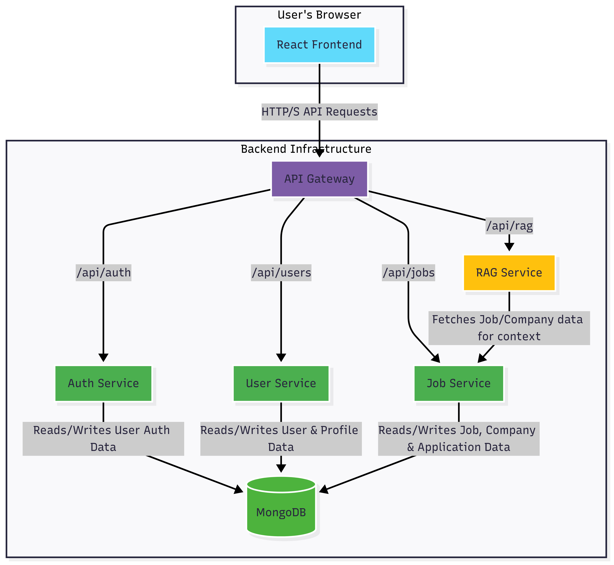
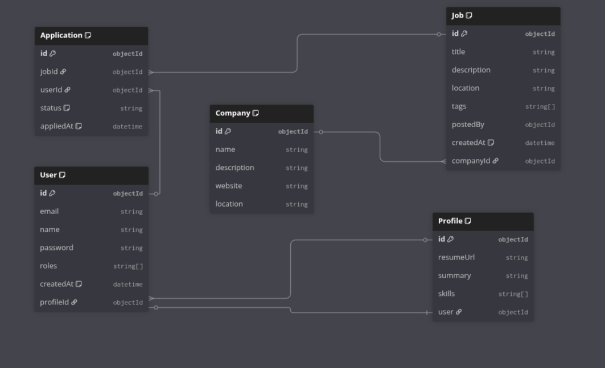

# Job Portal: A Modern, Microservices-Based Application

Welcome to the Job Portal project\! This is a full-stack web application designed to connect job seekers with employers through a clean and modern interface. It's built with a microservices architecture to keep things scalable and maintainable.

One of the standout features is an AI-powered assistant that can answer questions about job descriptions and companies, making the job search process a bit smarter.

## Core Features

- **Separate User Roles**: Custom dashboards and features for both **Job Seekers** and **Recruiters**.
- **Dynamic Job Search**: A powerful search bar lets users filter jobs by keywords, location, and relevant tags.
- **Easy Application Process**: Logged-in users can apply for jobs with just a couple of clicks.
- **Recruiter Tools**: Recruiters get their own space to post new jobs, manage their listings, and review incoming applications.
- **Company Profiles**: Companies have dedicated pages showing their description, website, and all their open roles.
- **User Profiles**: Job seekers can build a personal profile with a professional summary, skills, and a link to their resume.
- **AI Assistant (RAG)**: An "Ask AI" feature that uses the job and company data within the portal to provide intelligent, relevant answers to user questions.



---

## Tech Stack

This project is split into a frontend application and several backend microservices that work together.

#### **Frontend**

- **Framework**: React (with Vite)
- **Language**: TypeScript
- **Styling**: Tailwind CSS
- **State Management**: Zustand
- **Data Fetching**: TanStack Query (React Query)
- **Icons**: Lucide Icons

#### **Backend**

- **Architecture**: Microservices
- **Languages**: Node.js (TypeScript) & Python
- **Frameworks**: Express.js & Flask
- **Database**: MongoDB
- **ORM**: Prisma
- **API Gateway**: A central gateway that directs traffic to the correct service.

## 

## Getting Started

The best way to get this project up and running is with Docker, which handles all the setup for you.

### **Prerequisites**

Make sure you have these tools installed on your machine:

- Docker and Docker Compose
- Node.js (v18 or later)
- Python (v3.9 or later)

### **1. Clone the Repository**

First, get the code on your local machine.

```bash
git clone <your-repository-url>
cd <your-repository-directory>
```

### **2. Configure Your Environment**

The application needs an API key for the AI service to work.

1.  Create a new file named `.env` in the root of the project.

2.  Add your GitHub token to this file. The RAG service uses it for API access.

    ```env
    # .env
    GITHUB_TOKEN=your_actual_github_token
    ```

    _The Docker configuration will automatically pick up this token and provide it to the right service._

### **3. Run the Application with Docker**

With Docker, a single command starts everything: the database, all the backend services, and the frontend.

```bash
docker-compose up --build
```

- The `--build` flag is important for the first time you run this, as it tells Docker to build the necessary images.
- Once everything is running, you can access the application here:
  - **Frontend**: `http://localhost:5173`
  - **API Gateway**: `http://localhost:4000`

To shut everything down, just press `Ctrl + C` in the terminal where Docker Compose is running.

---

## Project Structure

Here’s a quick look at how the project is organized:

```
.
├── docker-compose.yml   # The main file that orchestrates all services
├── frontend/            # The React frontend application
│   └── Dockerfile.frontend
└── backend/             # Contains all backend microservices
    ├── Dockerfile.node
    ├── prisma/          # The database schema and Prisma client
    └── services/
        ├── auth-service/
        ├── gateway/
        ├── job-service/
        ├── user-service/
        └── rag-service/     # The Python service for the AI features
            └── Dockerfile.python
```
